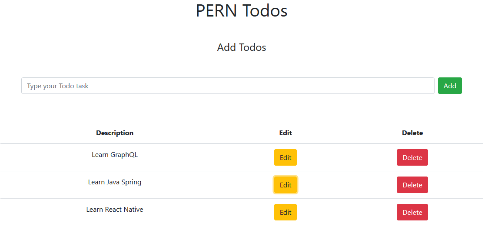

# PERN TODO

PERN application using following stcak.
    
    - Postgres
    - Express
    - React
    - Node

Just eveloving my skills with `MERN`, `MEAN` and `PERN` skills.

### How to use
1. If you have **Postgres** SQL application is installed on your machine then just goto step **04**.
2. If you don't have **Postgres**, then either install it or you can have using **docker** container. (Docker must be installed on the system).
3. Use following commands to create postgres container.
    - Pull postgres image from docker hub.

        `docker pull postgres`
    - Create volume for postgres db container to persist data. If you don't do this the all the data will be vanish if your container crashed OR stopped due to any reason.

        `docker volume create postgresdata`

    - Creating a conatiner with name **postgresdb**, exposing **5432** port to outside of the conatainer, setting **posgresdbpassword** as the root password for the postgres, mounting volume for persistance using **postgres** image.

        `docker run -d --name postgresdb -p 5432:5432 -e POSTGRES_PASSWORD=posgresdbpassword -e PGDATA=/var/lib/postgresql/data/pgdata -v postgresdata:/var/lib/postgresql/data postgres`

    - The above command will create a container having postgres application hosted. To connect to container and the connect to postgres DB use following commands

        `docker exec -it postgresdb bash`

    - Login to postgres by default user name **postgres**

        `psql -U postgres`
    - Then you will have posgres-cli, we can use following command to list all databas, select any database or list all the table inside the selected databas.

        ```
        \t (This will list down all database)
        \c databsename (This will select database)
        \dt (This will list down all the tables inside the selected database)
        ```
4. After connecting to database, run the queries inside the file `sql/scripts.sql` to create our database and table structure.
5. Install the npm package dependencies using following command.

    - To install servers dependencies
        ```
        cd server && npm install
        ```

    - And to install clients dependencies
        ```
        cd client && npm install
        ```
6. Start the application server (node/express server) using following command
    ```
        cd server && node index.js
    ```
7. In new terminal/command window, start the front end code using follow command.
    ```
        cd client && npm start
    ```
8. If all the above steps are completed successfully the on `http://localhost:3000` you will be able to see the runnig application.

Note: Whatever you database configuartion you set, you have to update the same in `server/db.js` file.



## Author

Mujibur Rehman `<adna_coder />`

---
Created by `<adna_coder>` with ❤️